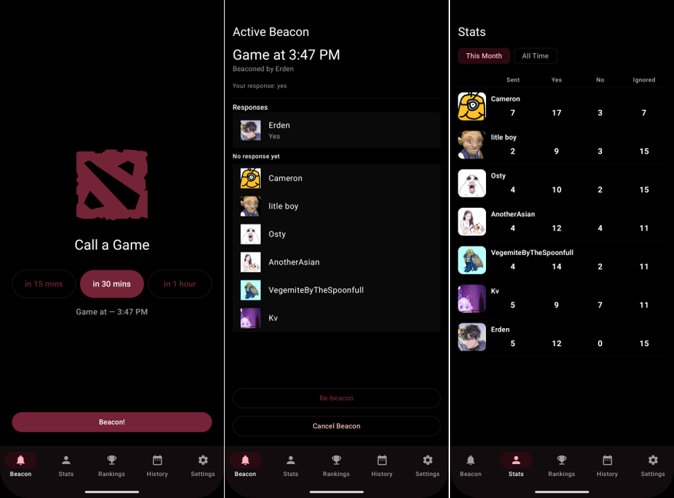
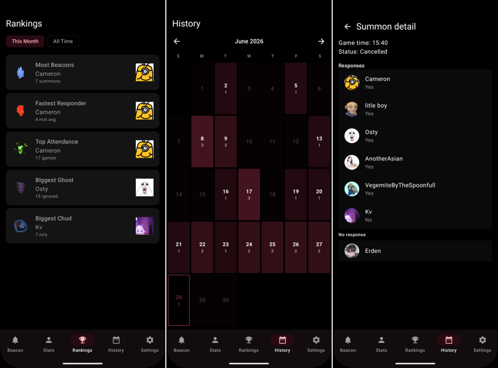

# Osquio

  
  
  
  
  

A closed-group Android app for getting your Dota 2 squad together. Someone calls a game, everyone gets a push notification, and you can see in real time who's in and who's ghosting.

---

## What it does

Osquio kills the "anyone down for Dota?" message chain. One person calls a game time, a loud push notification goes out to the whole group, and everyone taps their response. A live lobby shows who's in and who hasn't answered yet.

**Five tabs:**

| Tab | Purpose |
|---|---|
| Beacon | Active lobby, or beacon creation if none is open |
| Stats | Per-member stats visible to everyone |
| Rankings | Live badge leaderboard |
| History | Calendar view of all past beacons |
| Settings | Admin controls and config |

---

## Features

### Beacon
Any group member can call a game up to 2 hours out. Quick-fill buttons for 15 min, 30 min, and 1 hour, or pick a custom time.

### Push notifications
Everyone gets an FCM notification the second a beacon goes out — loud, high-priority, fires even when the app is closed.

### RSVP
Three options: **Yes**, **No**, or **Yes at [time]**. The "Yes at time" picker uses 5-minute increments. You can change your answer any time before the beacon closes.

### Live lobby
The lobby updates live via Supabase Realtime websockets — see who's in, who said no, and who still hasn't responded.

### Badges
Five live badges recalculated from stats — they can be won and lost:

| Badge | Awarded for |
|---|---|
| Most Beacons | Most beacons sent |
| Fastest Responder | Lowest average response time |
| Top Attendance | Most "yes" responses |
| Biggest Ghost | Most beacons ignored |
| Biggest Chud | Most "no" responses |

Stats are filterable between **This Month** and **All Time**.

### History
A calendar view of every past beacon. Tap a day to see what went down, tap a beacon to see the full breakdown — who said what, who ghosted, and when.

### Steam profiles
Display names and avatars are pulled from public Steam profile URLs — no API key needed. Profiles are cached in the database and refreshed every 7 days.

### Auto-update
On launch the app checks GitHub Releases for a newer APK and prompts a download if one exists. No Play Store involved.

---

## Tech stack

| Layer | Technology |
|---|---|
| Android | Kotlin + Jetpack Compose |
| Backend / DB | Supabase (Postgres, Auth, Realtime, Edge Functions) |
| Push notifications | Firebase Cloud Messaging V1 |
| Steam integration | Public Steam XML endpoint |

---

## License

GPL-3.0 — see [LICENSE](LICENSE) for details.
